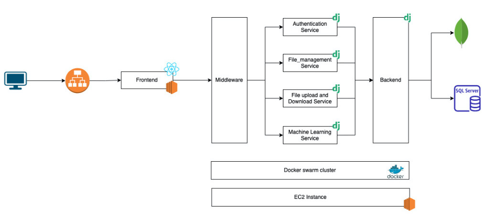

# Document_organizer Project

## System Architecture

We have designed the application with microservice architecture and divided the whole backend application into the above shown services. These services have independent databases and chosen databases (MySql or MongoDB) based on the needs for that particular service. A docker-compose file is provided which builds containers for all services and run the whole application stack.

## How to Run
* To run the servers and frontend (web) just run `docker-compose up`
* Access the web app at `localhost:3000`
* Following are the API Docs URL for each service
    - Authentication: `localhost:7001/`
    - FileManagement: `localhost:7002/`
    - FileUploader: `localhost:7003/`

